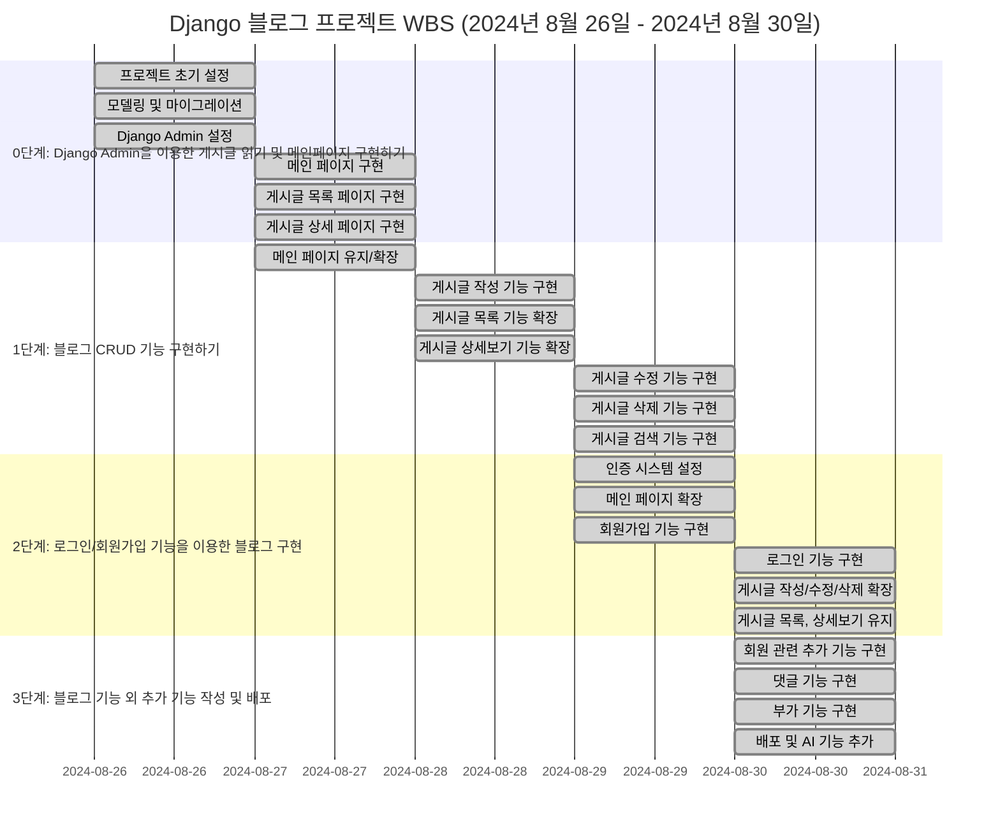

# Blog_project
장고로 만드는 블로그 서비스


# WBS

```mermaid
gantt
    title Django 블로그 프로젝트 WBS (2024년 8월 26일 - 2024년 8월 30일)
    dateFormat  YYYY-MM-DD
    section 0단계: Django Admin을 이용한 게시글 읽기 및 메인페이지 구현하기
    프로젝트 초기 설정             :done,  d0, 2024-08-26, 1d
    모델링 및 마이그레이션         :done,  d1, 2024-08-26, 1d
    Django Admin 설정             :done,  d2, 2024-08-26, 1d
    메인 페이지 구현               :done,  d3, 2024-08-27, 0.5d
    게시글 목록 페이지 구현         :done,  d4, 2024-08-27, 0.5d
    게시글 상세 페이지 구현         :done,  d5, 2024-08-27, 0.5d

    section 1단계: 블로그 CRUD 기능 구현하기
    메인 페이지 유지/확장          :done,  d6, 2024-08-27, 0.5d
    게시글 작성 기능 구현          :done,  d7, 2024-08-28, 1d
    게시글 목록 기능 확장          :done,  d8, 2024-08-28, 0.5d
    게시글 상세보기 기능 확장      :done,  d9, 2024-08-28, 0.5d
    게시글 수정 기능 구현          :done, d10, 2024-08-29, 1d
    게시글 삭제 기능 구현          :done, d11, 2024-08-29, 0.5d
    게시글 검색 기능 구현          :done, d12, 2024-08-29, 0.5d

    section 2단계: 로그인/회원가입 기능을 이용한 블로그 구현
    인증 시스템 설정              :done, d13, 2024-08-29, 1d
    메인 페이지 확장              :done, d14, 2024-08-29, 0.5d
    회원가입 기능 구현            :done, d15, 2024-08-29, 0.5d
    로그인 기능 구현              :done, d16, 2024-08-30, 0.5d
    게시글 작성/수정/삭제 확장     :done, d17, 2024-08-30, 0.5d
    게시글 목록, 상세보기 유지     :done, d18, 2024-08-30, 0.5d

    section 3단계: 블로그 기능 외 추가 기능 작성 및 배포
    회원 관련 추가 기능 구현      :done, d19, 2024-08-30, 0.5d
    댓글 기능 구현               :done, d20, 2024-08-30, 0.5d
    부가 기능 구현               :done, d21, 2024-08-30, 0.5d
    배포 및 AI 기능 추가          :done, d22, 2024-08-30, 0.5d
```

# URL 관계도

```
# ERD
