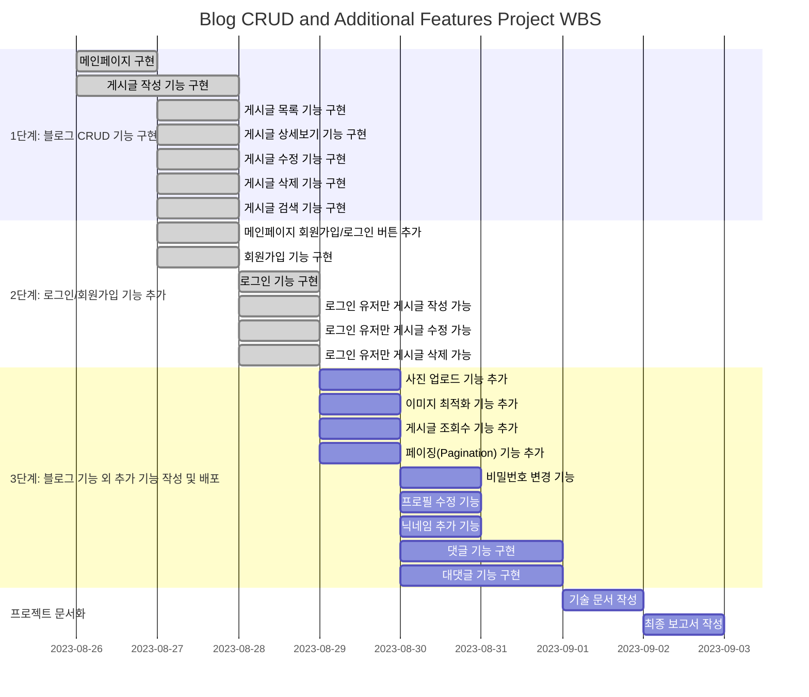
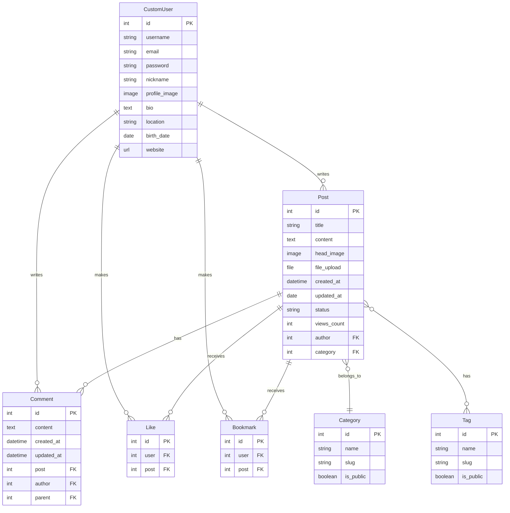

# django_tech_blog
장고로 기본 블로그 만들기

프로젝트 기간 : 2024.08.26 ~ 2024.09.02 (8일)
프로젝트 인원 : 1명
# 목차
- [django\_tech\_blog](#django_tech_blog)
- [목차](#목차)
- [1. 프로젝트 개요](#1-프로젝트-개요)
  - [1.1 프로젝트 소개](#11-프로젝트-소개)
  - [1.2 주요 기능](#12-주요-기능)
  - [1.3 기술 스택](#13-기술-스택)
- [2. 개발 환경](#2-개발-환경)
  - [2.1 사용된 버전](#21-사용된-버전)
- [3. 프로젝트 구조와 WBS](#3-프로젝트-구조와-wbs)
  - [3.1 폴더 트리](#31-폴더-트리)
- [3.2 WBS](#32-wbs)
- [3.3 ERD](#33-erd)
- [4. 요구 명세](#4-요구-명세)
- [5. 사용 화면 및 주요 기능](#5-사용-화면-및-주요-기능)
  - [5.1 사용 화면](#51-사용-화면)
  - [5.2 주요 기능](#52-주요-기능)
- [6. URL 구조 및 기능 명세 (Monolithic)](#6-url-구조-및-기능-명세-monolithic)
  - [6.1 config](#61-config)
  - [6.2 accounts](#62-accounts)
  - [6.3 blog\_page](#63-blog_page)
- [8. 트러블 슈팅](#8-트러블-슈팅)
- [9. 배운점](#9-배운점)

# 1. 프로젝트 개요
## 1.1 프로젝트 소개

본 프로젝트는 Django를 활용한 기본적인 블로그 구현을 목표로합니다 

- 주요 목표

    - **블로그 설계 및 구현**: 사용자 친화적인 인터페이스와 기능적인 백엔드 시스템 구축
    - **데이터베이스 모델링 및 CRUD 기능 구현**: 효율적인 데이터 관리 및 조작 기능 구현
    - **사용자 인증 및 권한 관리**: 안전하고 개인화된 사용자 경험 제공
    - **프로젝트 문서화 및 설계**: 체계적인 프로젝트 관리 


## 1.2 주요 기능
- **게시글 관리 기능 (blog_page 앱)**

    - **게시글 작성, 수정, 삭제 기능**:
        - **설명:** 사용자가 기술 관련 글을 작성, 수정, 삭제할 수 있는 기능
        - **주요 기능:** 
            - 마크다운 지원으로 구조화된 글 작성
            - 이미지 업로드 기능
            - 카테고리 및 태그 지정
            - 게시글 상태 관리 (초안/발행됨/보류 중)
    - **게시글 조회 및 상세보기 기능**:
        - **설명:** 작성된 글을 목록으로 보거나 상세 내용을 확인하는 기능
        - **주요 기능:** 
            - 페이지네이션
            - 검색 및 필터링
            - 조회수 표시
            - 좋아요 기능
            - 북마크 기능
    - **댓글 기능**:
        - **설명:** 게시글에 대한 의견을 나눌 수 있는 기능
        - **주요 기능:**
            - 댓글 작성, 수정, 삭제
            - 대댓글 지원

- **사용자 인증 및 프로필 관리 기능 (accounts 앱)**

    - **회원가입 및 로그인/로그아웃 기능**:
        - **설명:** 사용자 계정 생성 및 인증 관리 기능
        - **주요 기능:** 
            - 이메일을 통한 회원가입
            - 로그인/로그아웃
    - **프로필 수정 및 비밀번호 변경 기능**:
        - **설명:** 사용자 정보 관리 및 보안 설정 기능
        - **주요 기능:** 
            - 프로필 이미지 업로드
            - 개인정보 수정 (닉네임, 자기소개 등)
            - 비밀번호 변경

- **추가 기능**
    - **검색 기능**: 
        - 키워드를 통한 게시글 검색
        - 카테고리 및 태그 기반 필터링

    - **반응형 디자인**:
        -  최적화된 레이아웃 제공

## 1.3 기술 스택


# 2. 개발 환경
## 2.1 사용된 버전
- Python : 3.11
- Django : 5.0.7
- Pillow : 10.4.0

# 3. 프로젝트 구조와 WBS
## 3.1 폴더 트리
```
django_tech_blog/
│
├── config/
│   ├── __init__.py
│   ├── asgi.py
│   ├── settings.py
│   ├── urls.py
│   └── wsgi.py
│
├── accounts/
│   ├── migrations/
│   ├── __init__.py
│   ├── admin.py
│   ├── apps.py
│   ├── forms.py
│   ├── models.py
│   ├── tests.py
│   ├── urls.py
│   └── views.py
│
├── blog_page/
│   ├── migrations/
│   ├── __init__.py
│   ├── admin.py
│   ├── apps.py
│   ├── forms.py
│   ├── models.py
│   ├── tests.py
│   ├── urls.py
│   └── views.py
│
├── main/
│   ├── __init__.py
│   ├── admin.py
│   ├── apps.py
│   ├── models.py
│   ├── tests.py
│   ├── urls.py
│   └── views.py
│
├── static/
│   ├── css/
│   │   └── style.css
│   └── js/
│       ├── base.js
│       ├── post_detail.js
│       └── write_page.js
│
├── templates/
│   ├── accounts/
│   │   ├── login.html
│   │   ├── logout.html
│   │   ├── password_change.html
│   │   ├── profile.html
│   │   ├── profile_edit.html
│   │   └── register.html
│   ├── blog_page/
│   │   ├── bookmarked_post.html
│   │   ├── category_list.html
│   │   ├── comment.html
│   │   ├── post_detail.html
│   │   ├── post_edit.html
│   │   ├── post_list.html
│   │   ├── post_search.html
│   │   ├── tag_list.html
│   │   ├── tag_page.html
│   │   └── write_page.html
│   └── base.html
│
├── manage.py
└── README.md
```

# 3.2 WBS


# 3.3 ERD


# 4. 요구 명세
- 사용자 관리 기능
    - 회원가입, 로그인, 로그아웃 기능
    - 사용자 프로필 수정 및 비밀번호 변경 기능
    - 프로필 이미지 업로드 기능

- 블로그 게시글 관리 기능
    - 게시글 작성, 수정, 삭제 기능
    - 게시글 목록 조회 및 상세 보기 기능
    - 게시글 검색 및 필터링 기능
    - 카테고리 및 태그 기능
    - 게시글 조회수 증가 기능

- 댓글 기능
    - 댓글 작성, 수정, 삭제 기능
    - 대댓글 기능

- 좋아요 및 북마크 기능
    - 게시글 좋아요 기능
    - 게시글 북마크 기능

- 기타 기능
    - 메인 페이지 구현
    - 반응형 웹 디자인
    - 페이지네이션 구현
    - 마크다운 지원

# 5. 사용 화면 및 주요 기능
## 5.1 사용 화면
<table border="1" style="width:100%;">
  <colgroup>
    <col style="width: 33%;">
    <col style="width: 33%;">
    <col style="width: 33%;">
  </colgroup>
    <tbody>
        <tr>
            <td>첫 화면</td>
            <td>로그인</td>
            <td>회원 가입</td>
        </tr>
        <tr>
            <td>
                
            </td>
            <td>
                
            </td>
                       <td>
                
            </td>
        </tr>
                <tr>
            <td>비밀번호 변경</td>
            <td>게시글 상세 화면</td>
            <td>게시글 생성</td>
        </tr>
        <tr>
            <td>
                
            </td>
            <td>
                
            </td>
                       <td>
                
            </td>
        </tr>
                <tr>
            <td>게시글 리스트화면</td>
            <td>유저 프로필</td>
            <td>프로필 수정</td>
        </tr>
        <tr>
            <td>
                
            </td>
            <td>
                
            </td>
                       <td>
                
            </td>
        </tr>
    </tbody>
</table>

## 5.2 주요 기능

- **게시글 관리 기능 (blog_page 앱)**

    - **게시글 작성, 수정, 삭제 기능**:
        - **설명:** 사용자가 기술 관련 글을 작성하고, 기존 게시글을 수정하거나 삭제할 수 있는 기능입니다.
        - **주요 기능:** 
            - 마크다운 지원으로 구조화된 글 작성 가능
            - 이미지 업로드 기능으로 시각적 콘텐츠 추가
            - 카테고리 및 태그 지정으로 글 분류 및 검색 용이성 증대
            - 게시글 상태 관리 (초안/발행됨/보류 중)로 유연한 글 관리
            - 관련 게시글 연결 기능으로 연계성 있는 콘텐츠 제공

    - **게시글 조회 및 상세보기 기능**:
        - **설명:** 게시글 목록을 확인하고, 특정 게시글의 세부 정보를 볼 수 있는 기능입니다.
        - **주요 기능:** 
            - 제목, 내용, 태그 기반의 게시글 검색 기능
            - 카테고리와 태그를 이용한 게시글 필터링
            - 조회수 자동 증가 기능으로 인기 게시글 파악 가능
            - 댓글 및 대댓글 작성 기능으로 사용자 간 소통 활성화
            - 좋아요 기능으로 게시글 선호도 표시
            - 북마크 기능으로 관심 게시글 저장 및 관리

- **사용자 인증 및 프로필 관리 기능 (accounts 앱)**

    - **회원가입 및 로그인/로그아웃 기능**:
        - **설명:** 새로운 사용자가 계정을 생성하고, 로그인/로그아웃할 수 있는 기능입니다.
        - **주요 기능:** 
            - 이메일 주소를 이용한 회원가입
            - 중복 아이디/이메일 체크로 계정 유일성 보장
            - 안전한 비밀번호 설정을 위한 복잡성 검증
            - 로그인 상태 유지 기능으로 사용자 편의성 증대
            - 비밀번호 재설정 기능으로 계정 접근성 향상

    - **프로필 수정 및 비밀번호 변경 기능**:
        - **설명:** 사용자가 자신의 프로필 정보와 비밀번호를 수정할 수 있는 기능입니다.
        - **주요 기능:** 
            - 프로필 이미지 업로드 및 변경 기능
            - 닉네임, 자기소개, 위치 등 개인정보 수정 기능
            - 이메일 주소 변경 시 재인증 프로세스
            - 안전한 비밀번호 변경을 위한 현재 비밀번호 확인
            - 사용자 활동 내역 (작성 글, 북마크 등) 조회 기능

- **댓글 관리 기능**

    - **설명:** 게시글에 대한 사용자 간 소통을 위한 댓글 기능입니다.
    - **주요 기능:** 
        - 실시간 댓글 작성 및 표시 기능
        - 대댓글 기능으로 심층적인 토론 가능
        - 댓글 수정 및 삭제 기능
        - 댓글 작성자 프로필 연동

- **검색 및 필터링 기능**

    - **설명:** 사용자가 원하는 정보를 쉽게 찾을 수 있도록 하는 기능입니다.
    - **주요 기능:** 
        - 키워드 기반의 전체 검색 기능
        - 제목, 내용, 작성자, 카테고리, 태그별 세부 검색 기능
        - 카테고리 및 태그를 이용한 게시글 필터링

- **추가 기능**

    - **조회수 및 인기 게시글**: 게시글 조회 시 자동으로 조회수가 증가합니다.
    - **관련 게시글 추천**: 현재 보고 있는 게시글과 관련된 다른 게시글을 추천하여 사용자의 관심사에 맞는 콘텐츠를 제공합니다.
    - **반응형 웹 디자인**: 다양한 디바이스에서 최적화된 사용자 경험을 제공합니다.
    - **소셜 미디어 공유**: 게시글을 다양한 소셜 미디어 플랫폼에 쉽게 공유할 수 있는 기능을 제공합니다.
    - **사용자 활동 로그**: 사용자의 글 작성, 댓글, 좋아요 등의 활동을 기록하고 확인할 수 있는 기능을 제공합니다.

# 6. URL 구조 및 기능 명세 (Monolithic)
## 6.1 config
| URL 패턴         | 연결된 URL 설정                   | 연결된 Template        | 설명                   |
|------------------|-----------------------------------|------------------------|------------------------|
| `admin/`         | `admin.site.urls`                 |                        | Django 관리자 페이지    |
| `accounts/`      | `include("accounts.urls")`        |                        | 사용자 계정 관련 기능  |
| `blog/`          | `include("blog_page.urls")`       |                        | 블로그 관련 기능       |
| `/`              | `include("main.urls")`            |                        | 메인 페이지            |

## 6.2 accounts
| URL 패턴                         | 연결된 뷰                              | 연결된 Template                  | 설명                    |
|----------------------------------|-----------------------------------------|-----------------------------------|-------------------------|
| `register/`                      | `RegisterView.as_view()`                | `accounts/register.html`          | 회원가입 페이지          |
| `login/`                         | `LoginView.as_view()`                   | `accounts/login.html`             | 로그인 페이지            |
| `logout/`                        | `LogoutView.as_view()`                  | `accounts/logout.html`            | 로그아웃 기능            |
| `profile/`                       | `ProfileView.as_view()`                 | `accounts/profile.html`           | 사용자 프로필 페이지     |
| `profile_edit/`                  | `ProfileUpdateView.as_view()`           | `accounts/profile_edit.html`      | 사용자 프로필 수정       |
| `password_change/`               | `CustomPasswordChangeView.as_view()`    | `accounts/password_change.html`   | 비밀번호 변경 페이지     |

- accounts 기능 명세
    - **회원가입 뷰 (RegisterView)**
        - **설명:** 사용자의 회원가입을 처리하는 뷰입니다.
        - **기능:** 이메일, 사용자명, 비밀번호를 입력받아 새로운 계정을 생성합니다.
    - **로그인 뷰 (LoginView)**
        - **설명:** 사용자 로그인을 처리하는 뷰입니다.
        - **기능:** 사용자명과 비밀번호를 입력받아 인증을 수행합니다.
    - **프로필 뷰 (ProfileView)**
        - **설명:** 사용자의 프로필 정보를 표시하는 뷰입니다.
        - **기능:** 사용자의 개인정보와 작성한 게시글 목록을 보여줍니다.
    - **프로필 수정 뷰 (ProfileUpdateView)**
        - **설명:** 사용자가 자신의 프로필 정보를 수정할 수 있는 뷰입니다.
        - **기능:** 닉네임, 프로필 이미지, 자기소개 등의 정보를 수정할 수 있습니다.
    - **비밀번호 변경 뷰 (CustomPasswordChangeView)**
        - **설명:** 사용자가 비밀번호를 변경할 수 있는 뷰입니다.
        - **기능:** 현재 비밀번호 확인 후 새 비밀번호로 변경할 수 있습니다.

## 6.3 blog_page
| URL 패턴                              | 연결된 뷰                              | 연결된 Template                    | 설명                                |
|---------------------------------------|-----------------------------------------|-------------------------------------|-------------------------------------|
| `/`                                   | `PostList.as_view()`                    | `blog/post_list.html`          | 게시글 목록 페이지                  |
| `<int:pk>/`                           | `PostDetail.as_view()`                  | `blog/post_detail.html`        | 게시글 상세보기 페이지              |
| `write/`                              | `PostCreate.as_view()`                  | `blog/write_page.html`         | 게시글 작성 페이지                  |
| `edit/<int:pk>/`                      | `PostUpdate.as_view()`                  | `blog/post_edit.html`          | 게시글 수정 페이지                  |
| `delete/<int:pk>/`                    | `PostDelete.as_view()`                  |                                     | 게시글 삭제 기능                    |
| `search/`                             | `PostSearchView.as_view()`              | `blog/post_search.html`        | 게시글 검색 결과 페이지             |
| `<int:pk>/comment/`                   | `CommentCreate.as_view()`               |                                     | 댓글 작성 기능                      |
| `comment/<int:pk>/update/`            | `CommentUpdate.as_view()`               |                                     | 댓글 수정 기능                      |
| `comment/<int:pk>/delete/`            | `CommentDelete.as_view()`               |                                     | 댓글 삭제 기능                      |
| `category/<slug:slug>/`               | `category_page`                         | `blog/category_list.html`      | 카테고리별 게시글 목록 페이지       |
| `tag/<str:slug>/`                     | `tag_page`                              | `blog/tag_page.html`           | 태그별 게시글 목록 페이지           |
| `like/<int:post_id>/`                 | `like_post`                             |                                     | 게시글 좋아요 기능                  |
| `bookmark/<int:post_id>/`             | `toggle_bookmark`                       |                                     | 게시글 북마크 기능                  |

- blog 기능 명세
    - **게시글 목록 뷰 (PostList)**
        - **설명:** 게시글 목록을 표시하는 페이지입니다.
        - **기능:** 게시글 검색, 카테고리 필터링, 페이지네이션을 지원합니다.
    - **게시글 상세 뷰 (PostDetail)**
        - **설명:** 개별 게시글의 상세 내용을 표시하는 페이지입니다.
        - **기능:** 게시글 내용, 댓글 목록, 좋아요/북마크 기능을 제공합니다.
    - **게시글 작성 뷰 (PostCreate)**
        - **설명:** 새 게시글을 작성하는 페이지입니다.
        - **기능:** 제목, 내용, 카테고리, 태그 등을 입력받아 게시글을 생성합니다.
    - **게시글 수정 뷰 (PostUpdate)**
        - **설명:** 기존 게시글을 수정하는 페이지입니다.
        - **기능:** 게시글의 제목, 내용, 카테고리, 태그 등을 수정할 수 있습니다.
    - **댓글 관련 뷰 (CommentCreate, CommentUpdate, CommentDelete)**
        - **설명:** 댓글 생성, 수정, 삭제 기능을 제공합니다.
        - **기능:** AJAX를 이용한 실시간 댓글 처리를 지원합니다.
    - **카테고리 및 태그 관련 뷰**
        - **설명:** 카테고리와 태그별로 게시글을 분류하여 보여줍니다.
        - **기능:** 특정 카테고리나 태그에 속한 게시글 목록을 제공합니다.
    - **좋아요 및 북마크 기능**
        - **설명:** 게시글에 대한 좋아요 표시와 북마크 기능을 제공합니다.
        - **기능:** 사용자별로 북마크 상태를 관리합니다.

# 8. 트러블 슈팅

프로젝트를 진행하면서 다음과 같은 문제들을 겪고 해결했습니다:

1. **댓글 비동기 처리 문제**
   - 문제: 댓글 작성 시 페이지 전체가 새로고침되어 사용자 경험이 저하되었습니다.
   - 해결: AJAX를 이용한 비동기 처리로 변경하여 페이지 새로고침 없이 댓글이 추가되도록 구현했습니다.
   - 학습: JavaScript와 Django의 연동, RESTful API 설계의 중요성을 깨달았습니다.

2. **사용자 인증 보안**
   - 문제: 초기에 단순한 인증 방식으로 인해 보안 취약점이 있었습니다. ex(url 주소를 치면 들어가지는 점)
   - 해결: Django의 내장 인증 시스템을 활용하고, 비밀번호 해싱, CSRF 보호 등을 적용했습니다.
   - 학습: 웹 애플리케이션 보안의 중요성과 Django의 보안 기능에 대해 깊이 이해하게 되었습니다.

3. **태그 및 카테고리 관리**
   - 문제: 사용자가 입력한 태그와 카테고리의 중복 및 대소문자 구분 문제가 있었습니다.
   - 해결: 태그와 카테고리 입력 시 자동으로 소문자 변환 및 중복 체크 로직을 구현했습니다.
   - 학습: 데이터 정규화와 사용자 입력 처리의 중요성을 배웠습니다.

4. **페이지네이션 구현**
   - 문제: 게시글이 많아질수록 페이지 로딩 속도가 느려졌습니다.
   - 해결: Django의 Pagination 클래스를 활용하여 효율적인 페이지네이션을 구현했습니다.
   - 학습: 대량의 데이터 처리 방법과 사용자 경험 개선 기법을 익혔습니다.

5. **검색 기능 성능 개선**
   - 문제: 검색 시 전체 데이터베이스를 스캔하여 속도가 느렸습니다.
   - 해결: 데이터베이스 인덱싱을 적용하고, Django의 Q 객체를 활용하여 복잡한 검색 쿼리를 최적화했습니다.
   - 학습: 데이터베이스 최적화 기법과 효율적인 검색 알고리즘 구현 방법을 익혔습니다.


# 9. 배운점
- 처음에는 아무것도 모르니까 일단 계획말고 시작하자 였는 데 계획의 중요성을 다시한번 깨닫습니다. 